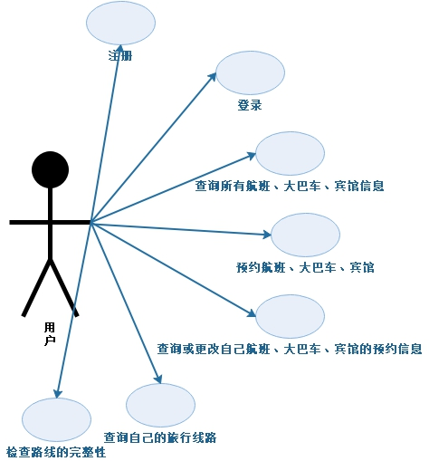
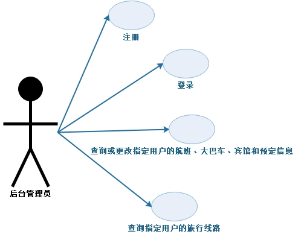
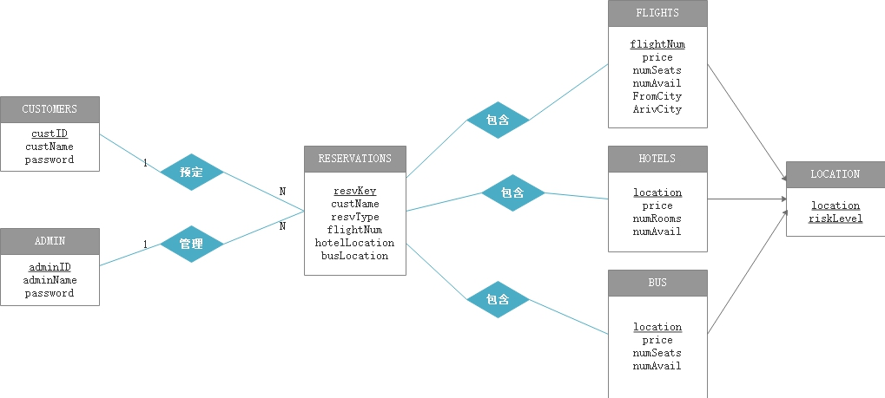

---

title: Document
---

[toc]

# **实验要求：**

基于MySQL，设计并实现一个简单的旅行预订系统。该系统涉及的信息有航班、大巴班车、宾馆房间和客户数据等信息。其关系模式如下：

* `FLIGHTS (String flightNum, int price, int numSeats, int numAvail, String FromCity, String ArivCity)；`

* `HOTELS(String location, int price, int numRooms, int numAvail)；`

* `BUS(String location, int price, int numBus, int numAvail)；`

* `CUSTOMERS(String custName, custID)；`

* `RESERVATIONS(String custName, int resvType, String resvKey) `

 

为简单起见，对所实现的应用系统作下列假设：

1. 在给定的一个班机上，所有的座位价格也一样；flightNum是表FLIGHTS的一个主码（primary key）。

2. 在同一个地方的所有的宾馆房间价格也一样；location是表HOTELS的一个主码。

3. 在同一个地方的所有大巴车价格一样；location是表 BUS的一个主码。

4. custName是表CUSTOMERS的一个主码。

5. 表RESERVATIONS包含着那些和客户预订的航班、大巴车或宾馆房间相应的条目，具体的说，resvType指出预订的类型（1为预订航班，2为预订宾馆房间，3为预订大巴车），而resvKey是表RESERVATIONS的一个主码。

6. 在表FLIGHTS中，numAvail表示指定航班上的还可以被预订的座位数。对于一个给定的航班（flightNum）,数据库**一致性的条件之一是**，表RESERVATIONS中所有预订该航班的条目数加上该航班的剩余座位数必须等于该航班上总的座位数。这个条件对于表BUS和表HOTELS同样适用。

 

## 应用系统应完成如下基本功能：

1． 航班，大巴车，宾馆房间和客户基础数据的入库，更新（表中的属性也可以根据你的需要添加）。

2． 预定航班，大巴车，宾馆房间。

3． 查询航班，大巴车，宾馆房间，客户和预订信息。

4． 查询某个客户的旅行线路。

5． 检查预定线路的完整性。

6． 其他任意你愿意加上的功能。

**7．** 通过高级程序语言（C/C++、Java，无限定）访问数据库，提供基本界面

 

## **作业检查：**

1． 提交源程序，可执行程序，以及程序运行说明。

2． 系统分析、设计与实现报告。

# 需求分析与概要设计

## 需求分析

1. 乘客

   

   

2. 后台管理员

## 数据库设计

### ER图

**注意：**数据库**一致性的条件之一**：表RESERVATIONS中所有预订该航班的条目数加上该航班的剩余座位数必须等于该航班上总的座位数。

* `ADMINS(String adminName, int adminID)`

|  字段名   |  字段类型   | 是否可为空 | 默认值 | 字段含义 | 注释 |
| :-------: | :---------: | :--------: | :----: | :------: | :--: |
|  adminID  |     INT     |  NOT NULL  |        | 管理员ID | 主键 |
| adminName | VARCHAR(50) |  NOT NULL  |        | 管理员名 |      |
| password  | VARCHAR(50) |  NOT NULL  |        |   密码   |      |

* `CUSTOMERS(String custName, int custID)；`

|  字段名  |  字段类型   | 是否可为空 | 默认值 | 字段含义 |     注释     |
| :------: | :---------: | :--------: | :----: | :------: | :----------: |
|  custID  |     INT     |  NOT NULL  |        |  乘客ID  |     主键     |
| custName | VARCHAR(50) |  NOT NULL  |        |  乘客名  |              |
| password | VARCHAR(50) |  NOT NULL  |        |   密码   |              |
| balance  |     INT     |  NOT NULL  |        |   余额   | 约束：大于零 |

* `FLIGHTS (String flightNum, int price, int numSeats, int numAvail, String FromCity, String ArivCity)；`

|  字段名   |  字段类型   | 是否可为空 | 默认值 |      字段含义      |     注释     |
| :-------: | :---------: | :--------: | :----: | :----------------: | :----------: |
| flightNum | VARCHAR(50) |  NOT NULL  |        |      航班编码      |     主键     |
|   price   |     INT     |  NOT NULL  |        |    每个座位价格    | 约束：大于零 |
| numSeats  |     INT     |  NOT NULL  |        |    总的座位数量    |              |
| numAvail  |     INT     |  NOT NULL  |        | 剩余可预约座位数量 |              |
| FromCity  | VARCHAR(50) |  NOT NULL  |        |       起飞地       |              |
| ArivCity  | VARCHAR(50) |  NOT NULL  |        |       目的地       |              |

* `HOTELS(String location, int price, int numRooms, int numAvail)；`

|  字段名  |  字段类型   | 是否可为空 | 默认值 |      字段含义      |     注释     |
| :------: | :---------: | :--------: | :----: | :----------------: | :----------: |
| location | VARCHAR(50) |  NOT NULL  |        |       地方名       |  主键，外键  |
|  price   |     INT     |  NOT NULL  |        |    每个房间价格    | 约束：大于零 |
| numRooms |     INT     |  NOT NULL  |        |     总的房间数     |              |
| numAvail |     INT     |  NOT NULL  |        | 剩余可预约房间数量 |              |
|          |             |            |        |                    |              |

* `BUS(String location, int price, int numBus, int numAvail)；`

|  字段名  |  字段类型  | 是否可为空 | 默认值 |      字段含义       |     注释     |
| :------: | :--------: | :--------: | :----: | :-----------------: | :----------: |
| location | VARCHA(50) |  NOT NULL  |        |       地方名        |  主键，外键  |
|  price   |    INT     |  NOT NULL  |        |   每次乘坐Bus价格   | 约束：大于零 |
| numSeats |    INT     |  NOT NULL  |        |    总的Bus座位数    |              |
| numAvail |    INT     |  NOT NULL  |        | 剩余可预约Bus座位数 |              |
|          |            |            |        |                     |              |
|          |            |            |        |                     |              |

* `RES_FLIGHT(String custName, int resvType, String resvKey) `

|  字段名   |  字段类型   | 是否可为空 | 默认值 |   字段含义   | 注释 |
| :-------: | :---------: | :--------: | :----: | :----------: | :--: |
|  resvKey  |     INT     |  NOT NULL  |        | 预约条目编码 | 主键 |
|  custID   | VARCHAR(50) |  NOT NULL  |        |    乘客ID    | 外键 |
| flightNum | VARCHAR(50) |  NOT NULL  |        |   航班编码   | 外键 |
|           |             |            |        |              |      |

* `RES_HOTEL(String custName, int resvType, String resvKey) `

|    字段名     |  字段类型   | 是否可为空 | 默认值 |   字段含义   | 注释 |
| :-----------: | :---------: | :--------: | :----: | :----------: | :--: |
|    resvKey    |     INT     |  NOT NULL  |        | 预约条目编码 | 主键 |
|    custID     | VARCHAR(50) |  NOT NULL  |        |    乘客ID    | 外键 |
| hotelLocation | VARCHAR(50) |  NOT NULL  |        |   宾馆位置   | 外键 |
|               |             |            |        |              |      |

* `RES_BUS(String custName, int resvType, String resvKey) `

|   字段名    |  字段类型   | 是否可为空 | 默认值 |   字段含义   | 注释 |
| :---------: | :---------: | :--------: | :----: | :----------: | :--: |
|   resvKey   |     INT     |  NOT NULL  |        | 预约条目编码 | 主键 |
|   custID    | VARCHAR(50) |  NOT NULL  |        |    乘客ID    | 外键 |
| busLocation | VARCHAR(50) |  NOT NULL  |        |   大巴位置   | 外键 |
|             |             |            |        |              |      |

* `LOCATION(String location)`

|  字段名   |  字段类型   | 是否可为空 | 默认值 |   字段含义   |    注释    |
| :-------: | :---------: | :--------: | :----: | :----------: | :--------: |
| location  | VARCHAR(50) |  NOT NULL  |        |    地方名    |    主键    |
| riskLevel | VARCHAR(50) |  NOT NULL  |        | 疫情风险等级 | 高、中、低 |

# 详细设计与实现

## 实体类图

# 业务逻辑

## USER

**注册**

* [x] admin_register
* [x] cust_register

POST

**登录**

* [x] admin_login
* [x] cust_login

POST

**登出**

* [x] logout

## CUSTOMER

**预定 FLIGHT、HOTEL、BUS**

* [ ] reserve_flight
* [ ] reserve_hotel
* [ ] reserve_bus

**查看预定信息**

* [ ] show_reservations

**查看自己的旅游路线**

* [ ] show_line

**检查旅游路线完整性**

* [ ] check_line

## ADMIN

**查看customers**/admins

* [x] show_customers
* [x] show_admins

**管理LOCATION**

* [x] add_location
* [x] change_location
* [x] delete_location
* [x] show_location

**管理FLIGHT**

* [x] add_flight
* [x] change_flight
* [x] delete_flight
* [x] show_flight

**管理HOTEL**

* [x] add_hotel
* [x] change_hotel
* [x] delete_hotel
* [x] show_hotel

**管理BUS**

* [x] add_bus
* [x] change_bus
* [x] delete_bus
* [x] show_bus
