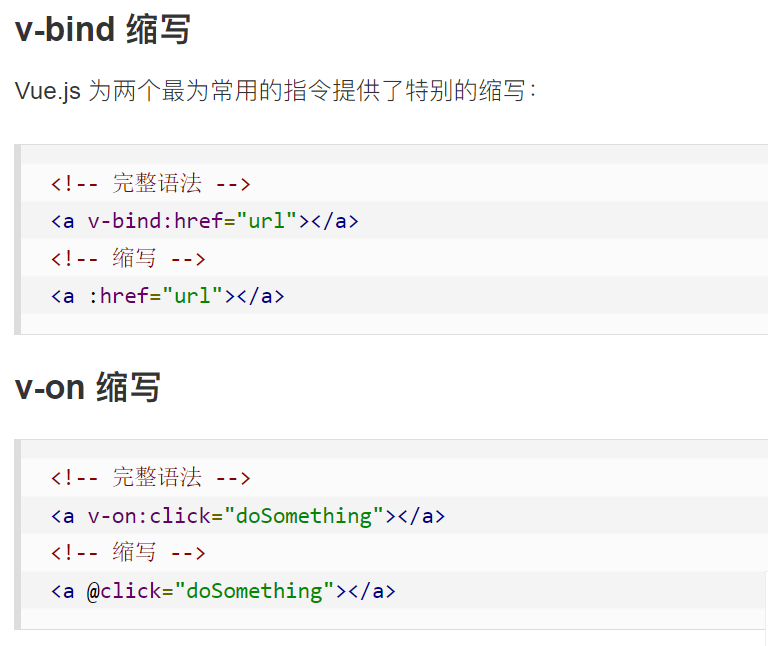

[Vue3  | 菜鸟教程 (runoob.com)](https://www.runoob.com/vue3/vue3-install.html)

>  Vue3 尽可能简单的 API 实现响应的数据绑定和组合的视图组件


## Vue3 模板语法

>  Vue 使用了基于 HTML 的模板语法，允许开发者声明式地将 DOM 绑定至底层 Vue 实例的数据。

>  Vue 的核心是一个允许你采用简洁的模板语法来声明式的将数据渲染进 DOM 的系统。

## 插值

`{{}}`


## 指令

指令是带有 v- 前缀的特殊属性。

指令用于在表达式的值改变时，将某些行为应用到 DOM 上。

* v-if
* v-bind
* v-model
* v-on

### 缩写




### v-model 双向数据绑定

**v-model** 指令用来在 **input、select、textarea、checkbox、radio 等表单控件元素**上创建双向数据绑定，根据表单上的值，自动更新绑定的元素的值。

* ```vue
  <p>{{ message }}</p>    
  <input v-model="message">
  ```

### v-on 监听事件

**按钮**的事件我们可以使用 **v-on** 监听事件，并对用户的输入进行响应（调用函数）

* ```vue
  <!-- 完整语法 -->
  <a v-on:click="doSomething"> ... </a>
  
  <!-- 缩写 -->
  <a @click="doSomething"> ... </a>
  
  <!-- 动态参数的缩写 (2.6.0+) -->
  <a @[event]="doSomething"> ... </a>
  ```

### v-if  v-else-if v-else 条件判断

 v-if 指令将根据表达式的值( true 或 false )来决定是否插入元素。

如果是多个元素，可以包裹在 <template> 元素上，并在上面使用 v-if。最终的渲染结果将不包含 <template> 元素。


### v-for 循环语句

以 **site in sites** 形式的特殊语法， sites 是源数据数组并且 site 是数组元素迭代的别名。

* v-for 可以绑定数据到数组来渲染一个列表。

* v-for 还支持一个可选的第二个参数index，参数值为当前项的索引。

* v-for 可以通过一个对象的属性来迭代数据

  * ```vue
    <li v-for="(value, key, index) in object">     
            {{ index }}. {{ key }} : {{ value }}    
    </li>
    ```

* v-for 也可以循环整数

## Vue3 组件

> 组件（Component）是 Vue.js 最强大的功能之一

> 组件可以扩展 HTML 元素，封装可重用的代码。

每个 Vue 应用都是通过用 createApp 函数创建的，传递给 createApp 的选项用于**配置根组件**。当我们挂载应用时，该组件被用作**渲染的起点**。


### 全局组件


### 局部组件

## Vue3 计算属性

`computed`

* 与method相比，computed基于依赖缓存，只有相关依赖发生改变时才会重新取值，而methods在重新渲染时，总会重新调用执行

* 默认属性`getter`和`setterr`


## watch 监听属性

通过 watch 来响应数据的变化

```vue3
vm.$watch('counter', function(nval, oval) {
    alert('计数器值的变化 :' + oval + ' 变为 ' + nval + '!');
```

```vue
const app = {
  data() {
    return {
      kilometers : 0,
      meters:0
    }
  },
  watch : {
	  kilometers:function(val) {
		  this.kilometers = val;
		  this.meters = this.kilometers * 1000
	  },
	  meters : function (val) {
		  this.kilometers = val/ 1000;
		  this.meters = val;
	  }
  }
}
```

## Vue 应用

* data + watch + methods

```vue
<!-- 因为 AJAX 库和通用工具的生态已经相当丰富，Vue 核心代码没有重复 -->
<!-- 提供这些功能以保持精简。这也可以让你自由选择自己更熟悉的工具。 -->
<script src="https://cdn.jsdelivr.net/npm/axios@0.12.0/dist/axios.min.js"></script>
<script>
  const watchExampleVM = Vue.createApp({
    data() {
      return {
        question: '',
        answer: '每个问题结尾需要输入 ? 号。'
      }
    },
    watch: {
      // 每当问题改变时，此功能将运行，以 ? 号结尾
      question(newQuestion, oldQuestion) {
        if (newQuestion.indexOf('?') > -1) {
          this.getAnswer()
        }
      }
    },
    methods: {
      getAnswer() {
        this.answer = '加载中...'
        axios
          .get('https://yesno.wtf/api')
          .then(response => {
            this.answer = response.data.answer
          })
          .catch(error => {
            this.answer = '错误! 无法访问 API。 ' + error
          })
      }
    }
  }).mount('#watch-example')
</script>
```


## Vue 3 事件处理

使用 v-on 指令来监听 DOM 事件 (click、submit、keyup等) ，从而执行 JavaScript 代码

1. 调用已定义的方法：<button @click="greet">点我</button>

2. 用内联 JavaScript 语句: <button @click="say('hi')">Say hi</button>

3. 事件处理程序中可以有多个方法：

   1. ```vue
      <div id="app">
        <!-- 这两个 one() 和 two() 将执行按钮点击事件 -->
        <button @click="one($event), two($event)">
        点我
        </button>
      </div>
       
      <script>
      const app = {
        data() {
        },
        methods: {
          one(event) {
            alert("第一个事件处理器逻辑...")
          },
          two(event) {
            alert("第二个事件处理器逻辑...")
          }
        }
      }
       
      Vue.createApp(app).mount('#app')
      </script>

### 事件修饰符

Vue.js 为 v-on 提供了事件修饰符来处理 DOM 事件细节


### 按键修饰符

Vue 允许为 v-on 在监听键盘事件时添加按键修饰符


## 表单

可以用 **v-model 指令**在表单 `<input>`、`<textarea>` 及 `<select>` 等元素上创建**双向数据绑定**


* v-model 会根据控件类型自动选取正确的方法来更新元素。

* v-model 会忽略所有表单元素的 value、checked、selected 属性的初始值，使用的是 data 选项中声明初始值。

v-model 在内部为不同的输入元素使用不同的属性并抛出不同的事件：

* text 和 textarea 元素使用 `value` 属性和 `input` 事件；
* checkbox 和 radio 使用 `checked` 属性和 `change` 事件；
* select 字段将 `value` 作为属性并将 `change` 作为事件。

### 输入框

```vue
<div id="app">
  <p>input 元素：</p>
  <input v-model="message" placeholder="编辑我……">
  <p>input 表单消息是: {{ message }}</p>
    
  <p>textarea 元素：</p>
  <textarea v-model="message2" placeholder="多行文本输入……"></textarea>
  <p>textarea 表单消息是:</p>
  <p style="white-space: pre">{{ message2 }}</p>
  
</div>
 
<script>
const app = {
  data() {
    return {
      message: '',
      message2: '菜鸟教程\r\nhttps://www.runoob.com'
    }
  }
}
 
Vue.createApp(app).mount('#app')
</script>
```


### 复选框

```vue
<div id="app">
  <p>单个复选框：</p>
  <input type="checkbox" id="checkbox" v-model="checked">
  <label for="checkbox">{{ checked }}</label>
    
  <p>多个复选框：</p>
  <input type="checkbox" id="runoob" value="Runoob" v-model="checkedNames">
  <label for="runoob">Runoob</label>
  <input type="checkbox" id="google" value="Google" v-model="checkedNames">
  <label for="google">Google</label>
  <input type="checkbox" id="taobao" value="Taobao" v-model="checkedNames">
  <label for="taobao">taobao</label>
  <br>
  <span>选择的值为: {{ checkedNames }}</span>
</div>
 
<script>
const app = {
  data() {
    return {
      checked : false,
      checkedNames: []
    }
  }
}
 
Vue.createApp(app).mount('#app')
</script>
```


### 单选框

```vue
<div id="app">
  <input type="radio" id="runoob" value="Runoob" v-model="picked">
  <label for="runoob">Runoob</label>
  <br>
  <input type="radio" id="google" value="Google" v-model="picked">
  <label for="google">Google</label>
  <br>
  <span>选中值为: {{ picked }}</span>
</div>
 
<script>
const app = {
  data() {
    return {
      picked : 'Runoob'
    }
  }
}
 
Vue.createApp(app).mount('#app')
</script>
```


### select 列表

```vue
<div id="app">
  <select v-model="selected" name="fruit">
    <option value="">选择一个网站</option>
    <option value="www.runoob.com">Runoob</option>
    <option value="www.google.com">Google</option>
  </select>
 
  <div id="output">
      选择的网站是: {{selected}}
  </div>
</div>
 
<script>
new Vue({
  el: '#app',
  data: {
    selected: '' 
  }
})
</script>
```

* 使用 **v-for** 循环输出选项

  * ```vue
        <option v-for="option in options" :value="option.value">
          {{ option.text }}
        </option>
    
      data() {
        return {
          selected: 'www.runoob.com',
          options: [
            { text: 'Runoob', value: 'www.runoob.com' },
            { text: 'Google', value: 'www.google.com' },
            { text: 'Taobao', value: 'www.taobao.com' }
          ]
        }
      }
    ```


## 路由

Vue 路由允许我们通过不同的 URL 访问不同的内容。

通过 Vue 可以实现多视图的单页 Web 应用（single page web application，SPA）。

### router-link

**<router-link>** 是一个组件，该组件用于设置一个导航链接，切换不同 HTML 内容。 **to** 属性为目标地址， 即要显示的内容

没有使用常规的 a 标签，而是使用一个自定义组件 router-link 来创建链接。这使得 Vue Router 可以在不重新加载页面的情况下更改 URL，处理 URL 的生成以及编码


### router-view

router-view 将显示与 url 对应的组件。你可以把它放在任何地方，以适应你的布局。

```vue
<!DOCTYPE html>
<html>
<head>
<meta charset="utf-8">
<title>Vue 测试实例 - 菜鸟教程(runoob.com)</title>
<script src="https://unpkg.com/vue@next"></script>
<script src="https://unpkg.com/vue-router@4"></script>
</head>
<body>
<div id="app">
  <h1>Hello App!</h1>
  <p>
    <!--使用 router-link 组件进行导航 -->
    <!--通过传递 `to` 来指定链接 -->
    <!--`<router-link>` 将呈现一个带有正确 `href` 属性的 `<a>` 标签-->
    <router-link to="/">Go to Home</router-link>
    <router-link to="/about">Go to About</router-link>
  </p>
  <!-- 路由出口 -->
  <!-- 路由匹配到的组件将渲染在这里 -->
  <router-view></router-view>
</div>

<script>
// 1. 定义路由组件.
// 也可以从其他文件导入
const Home = { template: '<div>Home</div>' }
const About = { template: '<div>About</div>' }
 
// 2. 定义一些路由
// 每个路由都需要映射到一个组件。
// 我们后面再讨论嵌套路由。
const routes = [
  { path: '/', component: Home },
  { path: '/about', component: About },
]
 
// 3. 创建路由实例并传递 `routes` 配置
// 你可以在这里输入更多的配置，但我们在这里
// 暂时保持简单
const router = VueRouter.createRouter({
  // 4. 内部提供了 history 模式的实现。为了简单起见，我们在这里使用 hash 模式。
  history: VueRouter.createWebHashHistory(),
  routes, // `routes: routes` 的缩写
})
 
// 5. 创建并挂载根实例
const app = Vue.createApp({})
//确保 _use_ 路由实例使
//整个应用支持路由。
app.use(router)
 
app.mount('#app')
 
// 现在，应用已经启动了！
</script>
</body>
</html>
```


## Ajax(axios) 完成请求

[Vue3 Ajax(axios) | 菜鸟教程 (runoob.com)](https://www.runoob.com/vue3/vue3-ajax-axios.html)

### GET

* 使用 **response.data** 读取 JSON 数据

* GET 方法传递参数格式


### POST

* POST 方法传递参数格式


