# 一、绪论

## 1.1 项目描述

​		基于MySQL，设计并实现一个简单的旅行预订系统。该系统涉及的信息有航班、大巴班车、宾馆房间和客户数据等信息。

## 1.2 开发环境和工具

* 操作系统：`Windows 10`
* 数据库管理系统：`MySQL`
* 数据库连接API：`mysqlclient`
* 程序设计语言：`Python`，`JavaScript`
* 开发框架：`Django`, `Vue`
* 集成开发环境：`Pycharm`
* 版本管理：`Github`

# 二、需求分析与概要设计

## 2.1 需求分析

​		该系统的用户有**管理员**和**乘客**。

​		**乘客**是注册为该系统用户的人，他能够查询地点，并预定该地点的大巴车和宾馆房间；查询航班，并且预定该航班；给自己的账户充值；查询自己的航班、大巴和宾馆预定信息；查看自己的旅行线路，并检查预定线路的完整性。

​		**管理员**也是注册为该系统用户的人，与乘客不同，他不能预定各种资源，但能够管理管理员、乘客、地点、航班、旅店和大巴等，以确保该旅游预订系统的安全与可靠。

​		**用例图：**

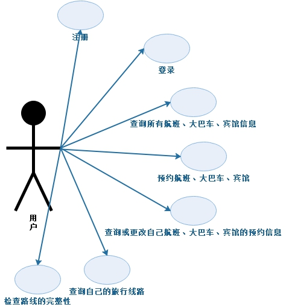

## 2.2 数据库设计

* 考虑设计规范：范式

* 考虑一致性约束
* 考虑事物的原子性

### 2.2.1 ER图

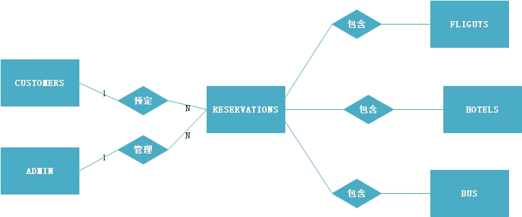

### 2.2.2 数据库表设计

**注意：**数据库**一致性的条件之一**：表RESERVATIONS中所有预订该航班的条目数加上该航班的剩余座位数必须等于该航班上总的座位数。

* **ADMINS：**

|  字段名   |  字段类型   | 是否可为空 | 默认值 | 字段含义 | 注释 |
| :-------: | :---------: | :--------: | :----: | :------: | :--: |
|  adminID  |     INT     |  NOT NULL  |        | 管理员ID | 主键 |
| adminName | VARCHAR(50) |  NOT NULL  |        | 管理员名 |      |
| password  | VARCHAR(50) |  NOT NULL  |        |   密码   |      |

* **CUSTOMERS：**

|  字段名  |  字段类型   | 是否可为空 | 默认值 | 字段含义 |     注释     |
| :------: | :---------: | :--------: | :----: | :------: | :----------: |
|  custID  |     INT     |  NOT NULL  |        |  乘客ID  |     主键     |
| custName | VARCHAR(50) |  NOT NULL  |        |  乘客名  |              |
| password | VARCHAR(50) |  NOT NULL  |        |   密码   |              |
| balance  |     INT     |  NOT NULL  |        |   余额   | 约束：大于零 |

* **LOCATION：**

|  字段名   |  字段类型   | 是否可为空 | 默认值 |   字段含义   |       注释       |
| :-------: | :---------: | :--------: | :----: | :----------: | :--------------: |
| location  | VARCHAR(50) |  NOT NULL  |        |    地方名    |       主键       |
| riskLevel | VARCHAR(50) |  NOT NULL  |        | 疫情风险等级 | 选择：高、中、低 |

* **FLIGHTS：**

|  字段名   |  字段类型   | 是否可为空 | 默认值 |      字段含义      |     注释     |
| :-------: | :---------: | :--------: | :----: | :----------------: | :----------: |
| flightNum | VARCHAR(50) |  NOT NULL  |        |      航班编码      |     主键     |
|   price   |     INT     |  NOT NULL  |        |    每个座位价格    | 约束：大于零 |
| numSeats  |     INT     |  NOT NULL  |        |    总的座位数量    |              |
| numAvail  |     INT     |  NOT NULL  |        | 剩余可预约座位数量 |              |
| FromCity  | VARCHAR(50) |  NOT NULL  |        |       起飞地       |     外键     |
| ArivCity  | VARCHAR(50) |  NOT NULL  |        |       目的地       |     外键     |

* **HOTELS：**

|  字段名  |  字段类型   | 是否可为空 | 默认值 |      字段含义      |     注释     |
| :------: | :---------: | :--------: | :----: | :----------------: | :----------: |
| location | VARCHAR(50) |  NOT NULL  |        |       地方名       |  主键，外键  |
|  price   |     INT     |  NOT NULL  |        |    每个房间价格    | 约束：大于零 |
| numRooms |     INT     |  NOT NULL  |        |     总的房间数     |              |
| numAvail |     INT     |  NOT NULL  |        | 剩余可预约房间数量 |              |
|          |             |            |        |                    |              |

* **BUS：**

|  字段名  |  字段类型  | 是否可为空 | 默认值 |      字段含义       |     注释     |
| :------: | :--------: | :--------: | :----: | :-----------------: | :----------: |
| location | VARCHA(50) |  NOT NULL  |        |       地方名        |  主键，外键  |
|  price   |    INT     |  NOT NULL  |        |   每次乘坐Bus价格   | 约束：大于零 |
| numSeats |    INT     |  NOT NULL  |        |    总的Bus座位数    |              |
| numAvail |    INT     |  NOT NULL  |        | 剩余可预约Bus座位数 |              |
|          |            |            |        |                     |              |
|          |            |            |        |                     |              |

* **RES_FLIGHT：**

|  字段名   |  字段类型   | 是否可为空 | 默认值 |   字段含义   |    注释    |
| :-------: | :---------: | :--------: | :----: | :----------: | :--------: |
|  resvKey  |     INT     |  NOT NULL  |        | 预约条目编码 | 主键，自增 |
|  custID   | VARCHAR(50) |  NOT NULL  |        |    乘客ID    |    外键    |
| flightNum | VARCHAR(50) |  NOT NULL  |        |   航班编码   |    外键    |
| resStatus | VARCHAR(50) |  NOT NULL  |        |   预约状态   |            |
| buildTime |  DATETIME   |    NULL    |        | 预约生成时间 |            |
| startTime |  DATETIME   |    NULL    |        | 订单开始时间 |            |
|  endTime  |  DATETIME   |    NULL    |        | 订单结束时间 |            |

* **RES_HOTEL：**

|    字段名     |  字段类型   | 是否可为空 | 默认值 |   字段含义   |    注释    |
| :-----------: | :---------: | :--------: | :----: | :----------: | :--------: |
|    resvKey    |     INT     |  NOT NULL  |        | 预约条目编码 | 主键，自增 |
|    custID     | VARCHAR(50) |  NOT NULL  |        |    乘客ID    |    外键    |
| hotelLocation | VARCHAR(50) |  NOT NULL  |        |   宾馆位置   |    外键    |
|   resStatus   | VARCHAR(50) |  NOT NULL  |        |   预约状态   |            |
|   buildTime   |  DATETIME   |    NULL    |        | 预约生成时间 |            |
|   startTime   |  DATETIME   |    NULL    |        | 订单开始时间 |            |
|    endTime    |  DATETIME   |    NULL    |        | 订单结束时间 |            |

* **RES_BUS：**

|   字段名    |  字段类型   | 是否可为空 | 默认值 |   字段含义   |    注释    |
| :---------: | :---------: | :--------: | :----: | :----------: | :--------: |
|   resvKey   |     INT     |  NOT NULL  |        | 预约条目编码 | 主键，自增 |
|   custID    | VARCHAR(50) |  NOT NULL  |        |    乘客ID    |    外键    |
| busLocation | VARCHAR(50) |  NOT NULL  |        |   大巴位置   |    外键    |
|  resStatus  | VARCHAR(50) |  NOT NULL  |        |   预约状态   |            |
|  buildTime  |  DATETIME   |    NULL    |        | 预约生成时间 |            |
|  startTime  |  DATETIME   |    NULL    |        | 订单开始时间 |            |
|   endTime   |  DATETIME   |    NULL    |        | 订单结束时间 |            |

##  2.3 功能模块

### 2.3.1 功能结构图

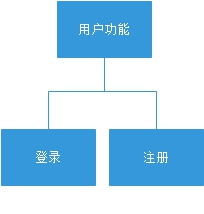

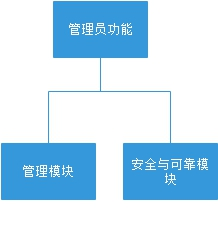

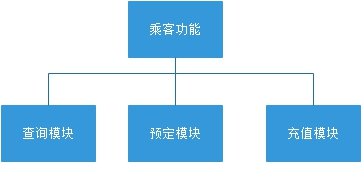

### 2.3.2  模块功能说明

1. 根据业务分析得到的具体需求，将系统进行模块化分析，可以将管理员功能划分为：管理模块和安全与可靠模块。具体每个功能如下：
   1. 管理模块：管理管理员信息、乘客信息、地点信息、航班信息、旅店信息和大巴信息；
   2. 安全与可靠模块：通过管理航班、旅店和大巴等资源的分配和回收，来确保该旅行预定系统的可靠与安全。
2. 将乘客功能划分为：查询模块、预定模块和充值模块。具体每个功能如下：
   1. 查询模块：乘客可以查询已被管理员添加的地点、航班、大巴和旅店，并且在其预定之后，还可以查询自己预定的大巴、旅店和航班信息和旅行路线；
   2. 预定模块：乘客可以预定某个地点的大巴和旅店，前提是管理员添加了该地点的大巴和旅店。还可以预定查询到的航班；
   3. 充值模块：乘客预定各种资源，都需要花费自己的余额，充值模块可以为其增加余额。

# 三、详细设计及实现

## 3.1 模块设计及业务逻辑设计

**业务逻辑的详细设计：**使用Django框架完成业务逻辑设计，所有业务逻辑按模块划分为三个部分，如下图所示：

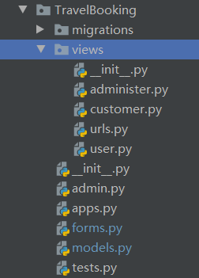

其中：

* user：登录登出注册模块
* customer：顾客模块
* administer：管理员模块

### 3.1.1 用户模块

注册为旅行预定系统的都为用户：管理员和乘客。

#### 3.1.1.1 登录

* login

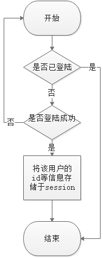

#### 3.1.1.2 注册

* register

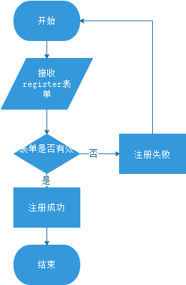

#### 3.1.1.3 登出

* logout

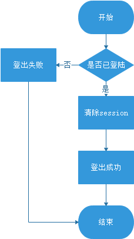

### 3.1.2 管理员模块

#### 3.1.2.1 添加资源

* add_location

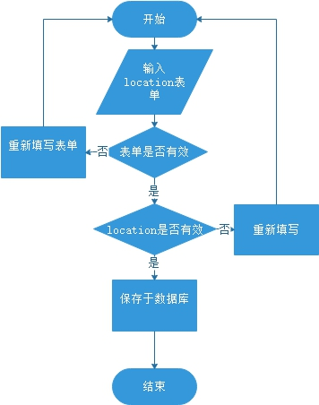

* add_flight

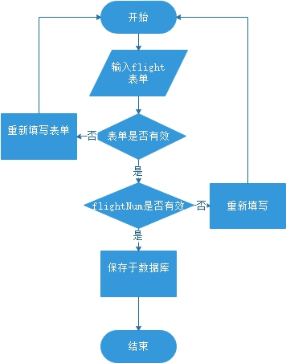

* add_bus

* add_hotel

#### 3.1.2.2 更新资源

* change_location

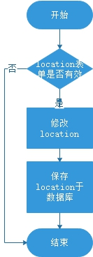

* change_flight

* change_hotel

* change_bus

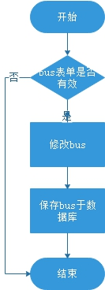

#### 3.1.2.3 展示资源

* show_admin

* show_customer

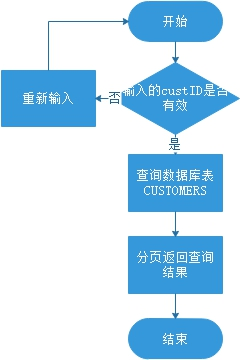

* show_location

* show_flight

* show_hotel

* show_bus

#### 3.1.2.4 删除资源

* delete_admin

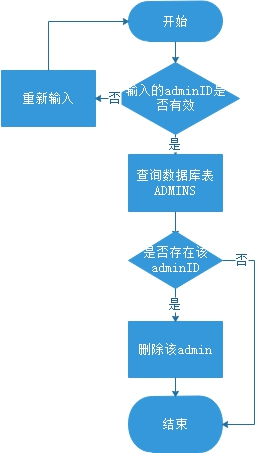

* delete_customer

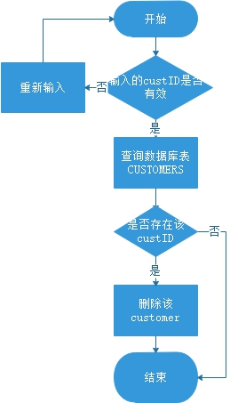

* delete_location

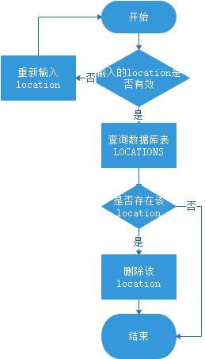

* delete_flight

* delete_hotel

* delete_bus

### 3.1.3 乘客模块

#### 3.1.3.1 展示已预定资源

* show_res_hotel

* show_res_bus

* show_res_flight

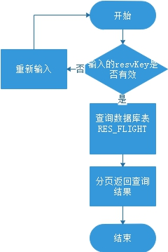

#### 3.1.3.2 预定资源

* reserve_flight

* reserve_hotel

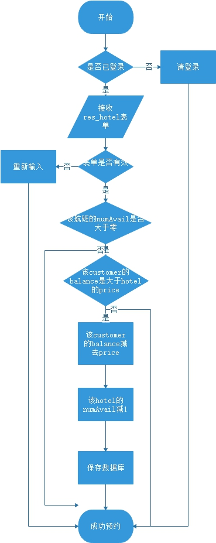

* reserve_bus

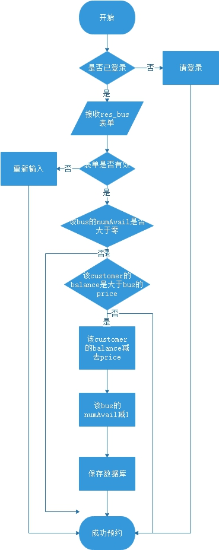

#### 3.1.3.3 展示旅行路线

* show_lines

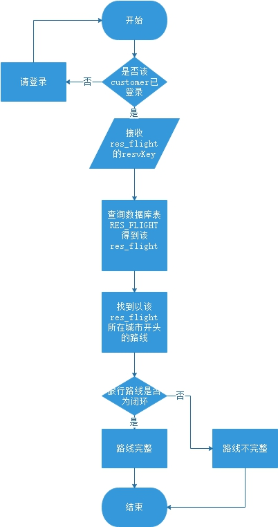

#### 3.1.3.4 充值

* deposit

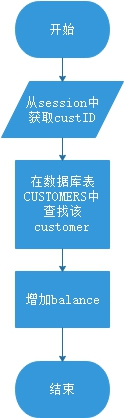

## 3.2 界面设计

**界面的详细设计：**使用Vue框架实现界面，划分为如下三部分：

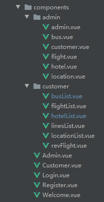

如上图所示，其中：

* home
* admin
* customer

# 四、系统测试

# 五、总结与思考

* 如何在django中实现数据库一致性约束和原子性
* 学习vue框架来完成前端的实现
* django和vue的整合
* django的session的丢失

