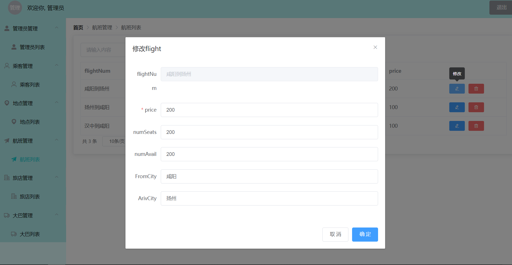

数据库系统

上机实验报告

实验名称：数据库第四次上机实验  

任课教师：刘伟  

课程班级：      1903051级           

学号姓名：  19030500024 马子豪    
 

提交日期：    2021年12月14日    

<b>目录

[toc]

# 一、绪论

## 1.1 项目描述

​		基于MySQL，设计并实现一个简单的旅行预订系统。该系统涉及的信息有航班、大巴班车、宾馆房间和客户数据等信息。

## 1.2 开发环境和工具

* 操作系统：`Windows 10`
* 数据库管理系统：`MySQL`
* 数据库连接API：`mysqlclient`
* 程序设计语言：`Python`，`JavaScript`
* 开发框架：`Django`, `Vue`
* 集成开发环境：`Pycharm`
* 版本管理：`Github`

# 二、需求分析与概要设计

## 2.1 需求分析

​		该系统的用户有**管理员**和**乘客**。

​		**乘客**是注册为该系统用户的人，他能够查询地点，并预定该地点的大巴车和宾馆房间；查询航班，并且预定该航班；给自己的账户充值；查询自己的航班、大巴和宾馆预定信息；查看自己的旅行线路，并检查预定线路的完整性。

​		**管理员**也是注册为该系统用户的人，与乘客不同，他不能预定各种资源，但能够管理管理员、乘客、地点、航班、旅店和大巴等，以确保该旅游预订系统的安全与可靠。

​		**用例图：**

## 2.2 数据库设计

* 该数据库在给定数据库的基础上**改进**，将预约数据库表 **RESERVATIONS** **拆分**成对应与三个资源的数据库表：**RES_FLIGHT、RES_HOTEL 和 RES_BUS**。这样使得数据库表中无多值属性和冗余数据。
  * 满足第三范式：**该数据库表中不存在非关键字段任一候选关键字段的传递函数依赖**

* 考虑一致性约束
* 考虑事务的原子性

### 2.2.1 概念结构设计——E-R图

**自己在创建数据库之前绘制的ER图：**

​		ER图如上所示，其中共七个实体：

* 在给定的数据库模式基础上，我添加了一个实体`LOCATION`，作为`BUS`，`HOTEL`和`FLIGHT`所引用的对象，并且作为他们的主键；
* 并且将原来的`RESERVATIONS`分割为三个实体——`RES_FLIGHT`, `RES_BUS`和`RES_HOTEL`，并且三者分别引用了`FLIGHT`, `BUS`和`HOTEL`，分别有一个自增属性`resKey`；

**由Mysql WorkBench逆向工程生成的ER图：**

其中：

* **虚线**表示两表之间是` identifying relationship`
* **实现**表示两表之间是 `non-identifying relationship`
* 黄色🔑：主键
* 红色🔑：引用外键作为主键

### 2.2.2 逻辑结构设计

* CUSTOMERS(<u>custID</u>, custName, password, balance)

* ADMINS(<u>adminID</u>, adminName, password)
* LOCATION(location, riskLevel)
* FLIGHTS(flightNum, price, numSeats, numAvail, FromCity, ArivCity)
* HOTELS(<u>location</u>, price, numRooms, numAvail)
* BUS(<u>location</u>, price, numSeats, numAvail)
* RES_FLIGHT(<u>resvKey</u>, custID, flightNum, resStatus)
* RES_HOTEL(<u>resvKey</u>, custID, location, resStatus)
* RES_BUS(<u>resvKey</u>, custID, location, resStatus)

### 2.2.3 数据库表设计

**注意：**数据库**一致性的条件之一**：表RESERVATIONS中所有预订该航班的条目数加上该航班的剩余座位数必须等于该航班上总的座位数。

* **ADMINS：**

|  字段名   |  字段类型   | 是否可为空 | 默认值 | 字段含义 | 注释 |
| :-------: | :---------: | :--------: | :----: | :------: | :--: |
|  adminID  |     INT     |  NOT NULL  |        | 管理员ID | 主键 |
| adminName | VARCHAR(50) |  NOT NULL  |        | 管理员名 |      |
| password  | VARCHAR(50) |  NOT NULL  |        |   密码   |      |

* **CUSTOMERS：**

|  字段名  |  字段类型   | 是否可为空 | 默认值 | 字段含义 |     注释     |
| :------: | :---------: | :--------: | :----: | :------: | :----------: |
|  custID  |     INT     |  NOT NULL  |        |  乘客ID  |     主键     |
| custName | VARCHAR(50) |  NOT NULL  |        |  乘客名  |              |
| password | VARCHAR(50) |  NOT NULL  |        |   密码   |              |
| balance  |     INT     |  NOT NULL  |        |   余额   | 约束：大于零 |

* **LOCATION：**

|  字段名   |  字段类型   | 是否可为空 | 默认值 |   字段含义   |       注释       |
| :-------: | :---------: | :--------: | :----: | :----------: | :--------------: |
| location  | VARCHAR(50) |  NOT NULL  |        |    地方名    |       主键       |
| riskLevel | VARCHAR(50) |  NOT NULL  |        | 疫情风险等级 | 选择：高、中、低 |

* **FLIGHTS：**

|  字段名   |  字段类型   | 是否可为空 | 默认值 |      字段含义      |     注释     |
| :-------: | :---------: | :--------: | :----: | :----------------: | :----------: |
| flightNum | VARCHAR(50) |  NOT NULL  |        |      航班编码      |     主键     |
|   price   |     INT     |  NOT NULL  |        |    每个座位价格    | 约束：大于零 |
| numSeats  |     INT     |  NOT NULL  |        |    总的座位数量    |              |
| numAvail  |     INT     |  NOT NULL  |        | 剩余可预约座位数量 |              |
| FromCity  | VARCHAR(50) |  NOT NULL  |        |       起飞地       |     外键     |
| ArivCity  | VARCHAR(50) |  NOT NULL  |        |       目的地       |     外键     |

* **HOTELS：**

|  字段名  |  字段类型   | 是否可为空 | 默认值 |      字段含义      |     注释     |
| :------: | :---------: | :--------: | :----: | :----------------: | :----------: |
| location | VARCHAR(50) |  NOT NULL  |        |       地方名       |  主键，外键  |
|  price   |     INT     |  NOT NULL  |        |    每个房间价格    | 约束：大于零 |
| numRooms |     INT     |  NOT NULL  |        |     总的房间数     |              |
| numAvail |     INT     |  NOT NULL  |        | 剩余可预约房间数量 |              |
|          |             |            |        |                    |              |

* **BUS：**

|  字段名  |  字段类型  | 是否可为空 | 默认值 |      字段含义       |     注释     |
| :------: | :--------: | :--------: | :----: | :-----------------: | :----------: |
| location | VARCHA(50) |  NOT NULL  |        |       地方名        |  主键，外键  |
|  price   |    INT     |  NOT NULL  |        |   每次乘坐Bus价格   | 约束：大于零 |
| numSeats |    INT     |  NOT NULL  |        |    总的Bus座位数    |              |
| numAvail |    INT     |  NOT NULL  |        | 剩余可预约Bus座位数 |              |
|          |            |            |        |                     |              |
|          |            |            |        |                     |              |

* **RES_FLIGHT：**

|  字段名   |  字段类型   | 是否可为空 | 默认值 |   字段含义   |    注释    |
| :-------: | :---------: | :--------: | :----: | :----------: | :--------: |
|  resvKey  |     INT     |  NOT NULL  |        | 预约条目编码 | 主键，自增 |
|  custID   | VARCHAR(50) |  NOT NULL  |        |    乘客ID    |    外键    |
| flightNum | VARCHAR(50) |  NOT NULL  |        |   航班编码   |    外键    |
| resStatus | VARCHAR(50) |  NOT NULL  |        |   预约状态   |            |
| buildTime |  DATETIME   |    NULL    |        | 预约生成时间 |            |
| startTime |  DATETIME   |    NULL    |        | 订单开始时间 |            |
|  endTime  |  DATETIME   |    NULL    |        | 订单结束时间 |            |

* **RES_HOTEL：**

|    字段名     |  字段类型   | 是否可为空 | 默认值 |   字段含义   |    注释    |
| :-----------: | :---------: | :--------: | :----: | :----------: | :--------: |
|    resvKey    |     INT     |  NOT NULL  |        | 预约条目编码 | 主键，自增 |
|    custID     | VARCHAR(50) |  NOT NULL  |        |    乘客ID    |    外键    |
| hotelLocation | VARCHAR(50) |  NOT NULL  |        |   宾馆位置   |    外键    |
|   resStatus   | VARCHAR(50) |  NOT NULL  |        |   预约状态   |            |
|   buildTime   |  DATETIME   |    NULL    |        | 预约生成时间 |            |
|   startTime   |  DATETIME   |    NULL    |        | 订单开始时间 |            |
|    endTime    |  DATETIME   |    NULL    |        | 订单结束时间 |            |

* **RES_BUS：**

|   字段名    |  字段类型   | 是否可为空 | 默认值 |   字段含义   |    注释    |
| :---------: | :---------: | :--------: | :----: | :----------: | :--------: |
|   resvKey   |     INT     |  NOT NULL  |        | 预约条目编码 | 主键，自增 |
|   custID    | VARCHAR(50) |  NOT NULL  |        |    乘客ID    |    外键    |
| busLocation | VARCHAR(50) |  NOT NULL  |        |   大巴位置   |    外键    |
|  resStatus  | VARCHAR(50) |  NOT NULL  |        |   预约状态   |            |
|  buildTime  |  DATETIME   |    NULL    |        | 预约生成时间 |            |
|  startTime  |  DATETIME   |    NULL    |        | 订单开始时间 |            |
|   endTime   |  DATETIME   |    NULL    |        | 订单结束时间 |            |

##  2.3 功能模块

### 2.3.1 功能结构图

### 2.3.2  模块功能说明

1. 根据业务分析得到的具体需求，将系统进行模块化分析，可以将管理员功能划分为：管理模块和安全与可靠模块。具体每个功能如下：
   1. 管理模块：管理管理员信息、乘客信息、地点信息、航班信息、旅店信息和大巴信息；
   2. 安全与可靠模块：通过管理航班、旅店和大巴等资源的分配和回收，来确保该旅行预定系统的可靠与安全。
2. 将乘客功能划分为：查询模块、预定模块和充值模块。具体每个功能如下：
   1. 查询模块：乘客可以查询已被管理员添加的地点、航班、大巴和旅店，并且在其预定之后，还可以查询自己预定的大巴、旅店和航班信息和旅行路线；
   2. 预定模块：乘客可以预定某个地点的大巴和旅店，前提是管理员添加了该地点的大巴和旅店。还可以预定查询到的航班；
   3. 充值模块：乘客预定各种资源，都需要花费自己的余额，充值模块可以为其增加余额。

# 三、详细设计及实现

## 3.1 模块设计及业务逻辑设计

**业务逻辑的详细设计：**使用Django框架完成业务逻辑设计，所有业务逻辑按模块划分为三个部分，如下图所示：

其中：

* user：登录登出注册模块
* customer：顾客模块
* administer：管理员模块

### 3.1.1 用户模块

注册为旅行预定系统的都为用户：管理员和乘客。

#### 3.1.1.1 登录

* login

#### 3.1.1.2 注册

* register

#### 3.1.1.3 登出

* logout

### 3.1.2 管理员模块

#### 3.1.2.1 添加资源

* add_location

* add_flight

* add_bus

* add_hotel

#### 3.1.2.2 更新资源

* change_location

* change_flight

* change_hotel

* change_bus

#### 3.1.2.3 展示资源

* show_admin

* show_customer

* show_location

* show_flight

* show_hotel

* show_bus

#### 3.1.2.4 删除资源

* delete_admin

* delete_customer

* delete_location

* delete_flight

* delete_hotel

* delete_bus

### 3.1.3 乘客模块

#### 3.1.3.1 展示已预定资源

* show_res_hotel

* show_res_bus

* show_res_flight

#### 3.1.3.2 预定资源

* reserve_flight

* reserve_hotel

* reserve_bus

#### 3.1.3.3 展示旅行路线

* show_lines

#### 3.1.3.4 充值

* deposit

## 3.2 界面设计

**界面的详细设计：**使用Vue框架实现界面，划分为如下三部分：

如上图所示，其中：

* home
* admin
* customer

# 四、系统测试

## 4.1 用户登录注册模块

### 4.1.1 登录测试

**管理员登录：**

**截图：**

**测试内容：**

​		输入登录ID、密码，选中”以管理员登陆“，点击登录。

**测试结果：**

​		账号密码出错时，弹出错误时提示框；

​		账号密码正确时，进入管理员界面。

**乘客登录：**

**截图：**

**测试内容：**

​		输入登录ID、密码，点击登录

**测试结果：**

​		账号密码出错时，弹出错误时提示框；

​		账号密码正确时，进入乘客界面。

### 4.1.2 注册测试

**注册管理员：**

**截图：**

**测试内容：**

​		输入ID、设置密码、确认密码和姓名，选择注册为管理员，点击注册。

**测试结果：**

​		当管理员ID与数据库中重复时，弹出错误提示框；当设置密码与确认密码不一致时，弹出错误提示框；当数据校验成功时，弹出注册成功。

**注册乘客：**

**截图：**

**测试内容：**

​		输入ID、设置密码、确认密码和姓名，点击注册。

**测试结果：**

​		当乘客ID与数据库中重复时，弹出错误提示框；当设置密码与确认密码不一致时，弹出错误提示框；当数据校验成功时，弹出注册成功。

## 4.2 管理员模块

**进入管理员界面：**

### 4.2.1 管理管理员

**查看管理员：**

**测试内容：**

​		点击管理员列表。

**测试结果：**

​		展示出所有管理员的信息。

**添加管理员：**

**测试内容：**

​		填入adminID、name、password1和password2，点击确定。

**测试结果：**

​		若adminID已存在于数据库中，则弹出报错；若密码不一致，则弹出报错；若数据有效，则添加成功。

**修改管理员信息：**

**测试内容：**

​		修改name和password，点击确定。

**测试结果：**

​		若数据有效，则修改成功。

**删除管理员：**

**测试内容：**

​		点击删除管理员。

**测试结果：**

​		若点击确定，则删除成功。

### 4.2.2 管理乘客

**查看乘客：**

**测试内容：**

​		点击乘客列表。

**测试结果：**

​		展示出所有乘客的信息。

**添加乘客：**

**测试内容：**

​		填入custID、name、password1和password2，点击确定。

**测试结果：**

​		若custID已存在于数据库中，则弹出报错；若密码不一致，则弹出报错；若数据有效，则添加成功。

**修改乘客信息：**

**测试内容：**

​		修改name和password，点击确定。

**测试结果：**

​		若数据有效，则修改成功。

**删除乘客：**

**测试内容：**

​		点击删除乘客。

**测试结果：**

​		若点击确定，则删除成功。

### 4.2.3 管理航班

**查看航班：**

**添加航班：**

**修改航班：**

**删除航班：**

### 4.2.4 管理旅店

### 4.2.5 管理大巴

## 4.3 乘客模块

### 4.3.1 充值

**充值：**

**测试内容：**

​		输入balance，点击确定。

**测试结果：**

​		充值成功。

### 4.3.2 预定

**预定旅馆：**

**测试内容：**

​		点击确定。

**测试结果：**

​		若余额足够并且numAvail大于1，预定Hotel成功；否则预定失败。

**预定Bus：**

**测试内容：**

​		点击确定。

**测试结果：**

​		若余额足够并且numAvail大于1，预定Bus成功；否则预定失败。

**预定航班：**

**测试内容：**

​		点击确定。

**测试结果：**

​		若余额足够并且numAvail大于1，预定flight成功；否则预定失败。

### 4.3.3 查看预定信息

**查看预定旅店信息：**

**测试内容：**

​		点击旅店管理->预定列表。

**测试结果：**

​		展示自己预定的所有旅店信息。

**查看预定的大巴信息：**

**测试内容：**

​		点击大巴管理->预定列表。

**测试结果：**

​		展示自己预定的所有大巴信息。

**查看预定航班信息：**

**测试内容：**

​		点击航班管理->预定列表。

**测试结果：**

​		展示自己预定的所有航班信息。

# 五、总结与思考

**遇到的问题：**

​		如何使用 Python 的web开发框架 Django 实现数据库的一致性约束和原子性

**解决方法：**

​		在使用 django 创建数据库表时，在相应的类中添加约束方法。

**遇到的问题：**

​		在开发时，我采用了前后端分离的方式，再分别开发完前后端之后，将Django项目运行在8000端口，而Vue项目运行在4000端口，此时后端的session并不能存储用户状态，使得登录之后的业务逻辑无法正常执行。

**解决方案：**

​		将Django和Vue项目整合为一个大项目，先将Vue项目build为一个静态文件，然后让Django配置好路径之后去访问。

**遇到的问题：**

​		Django接收到Vue的POST请求的表单为空。

**解决方案：**

​		因为Vue的POST请求表单实际上是一个字典，而在传输时需要使用qs中的stringify方法将数据转换成字符串，作业后端便可接收到正常数据。

* 如何在django中实现数据库一致性约束和原子性

* 学习vue框架来完成前端的实现

  

