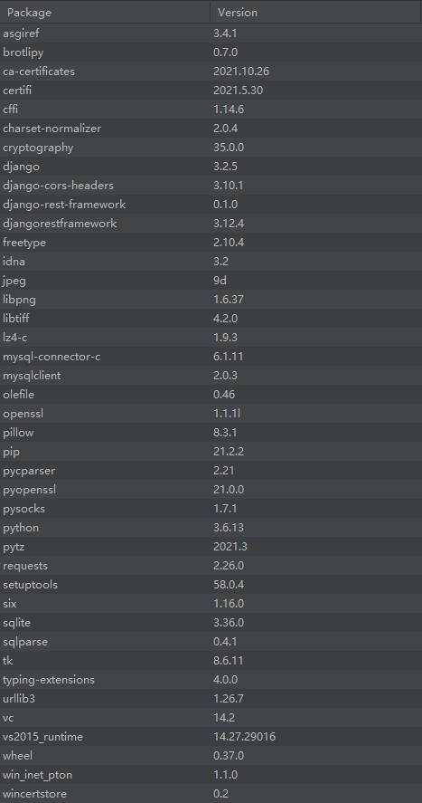

# Project_TravelBooking

* `TravelBookingSys.zip` :  项目`TravelBookingSys`源程序代码
* 运行项目环境：
  * Windows或者Linux操作系统
  * Python3.6以上
  * Python包依赖：
    * 
  * 若要修改页面，需要使用Vue修改并执行`npm run build`重新生成静态文件
* 运行说明：
  1. 解压到本地
  2. 使用Pycharm运行即可（注意查看Django项目下的setting.py中的端口配置是否与其他项目冲突）
